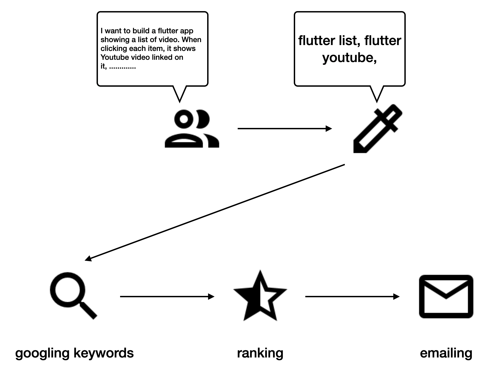
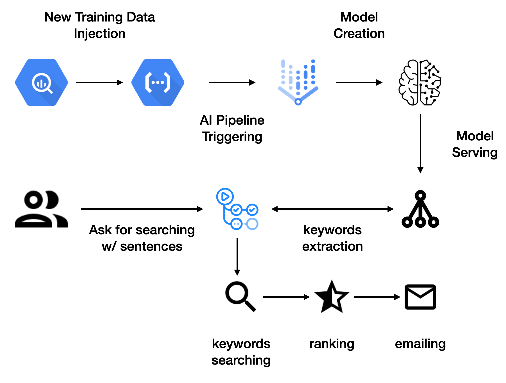

# little-jarvis

This project aims to build a simple virtual assistant called "little jarvis(LJ)". Below describes what functionality it aims to provide.

1. User inputs a set of sentences describing what he/she wants to search for into LJ.
2. LJ extracts some important keywords via Bert based AI model.
3. LJ googles with extracted keywords.
4. LJ ranks searching results based on user feedback and the information provided by Google. 
5. LJ sends out an email by re-organizing what it has found.
6. User is happy to go through the most relevant searching results in the morning witha cup of coffee.

# architecture

This project aims to leverage services from Google Cloud Platform. The key services include `Vertex AI / AI Platform` for MLOps, `Cloud Run` for serverlessly handling user request, `BigQuery` for storing the history of user inputs.

Along with GCP services, this project also uses `TFX(TensorFlow Extended)` and `TensorFlow` for Machine Learning part. 

# Things to do

- [ ] Build an ML Pipeline with `TFX` and `Vertex AI`
- [ ] Build an ML model for keyword extraction
- [ ] Write codes to invoke google searching 
- [ ] Write codes to rank searching results
- [ ] Write codes to send an email
- [ ] Integrate logics with GitHub Action